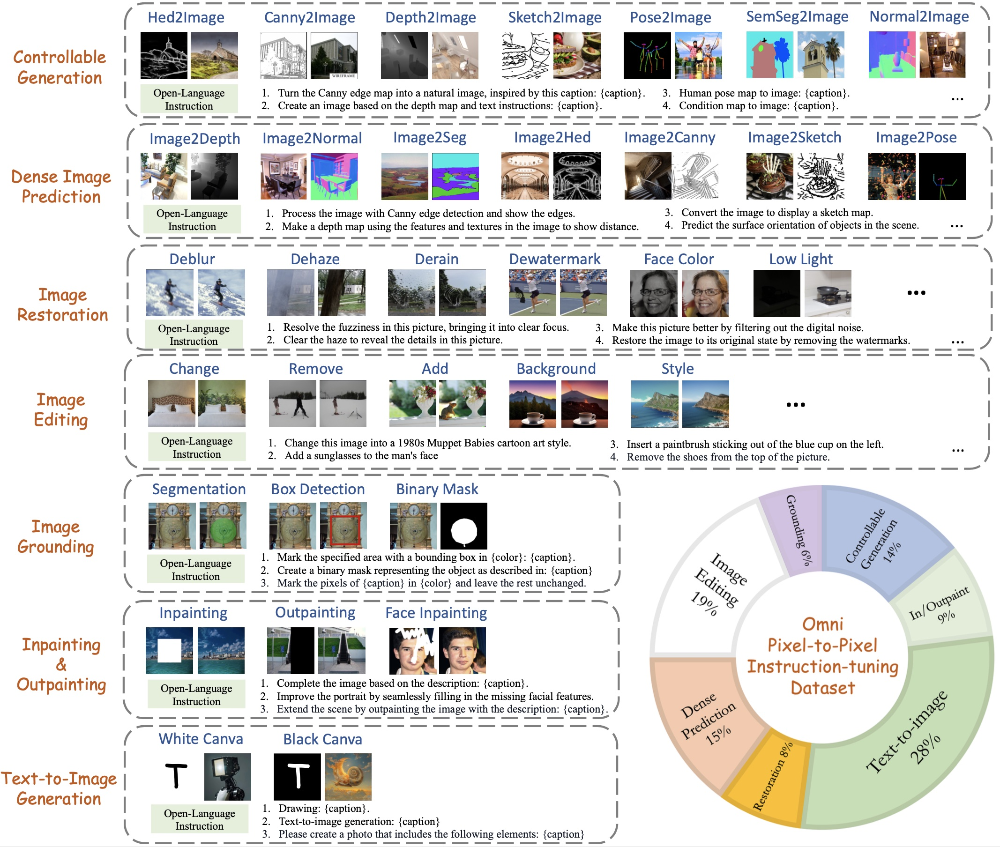
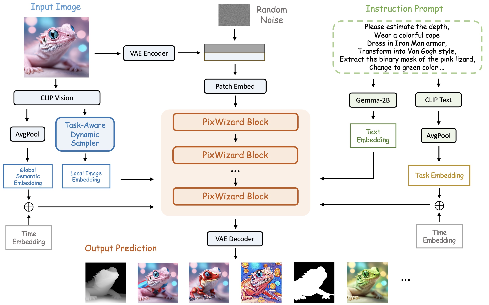

<div align="center">

# 🧙 PixWizard: Versatile Image-to-Image Visual Assistant with Open-Language Instructions 

</div>

This work presents a versatile image-to-image visual assistant, PixWizard, designed for image generation, manipulation, and translation based on free-from user instructions. [[📖 Paper](https://arxiv.org/abs/2409.15278)]


## 💥 Planning

- ✅ Release the Paper
- ✅ Release the Model
- ✅ Release the Code
- - [x] Supported in the diffusers

## 👀 Overview

### 🧐 Task&Data Overview

<div align="center">
  
</div>

### 🧐 Model Overview

<div align="center">
  
</div>


## 🤖️ Model Zoo

| Resolution | PixWizard Parameter| Text Encoder | VAE Encoder | Prediction | Download URL  |
| ---------------- | ----------------------- | ---------------------------------------------------- | ----------------|---------------------------- |
| 512-768-1024     |           2B            |  [Gemma-2B](https://huggingface.co/google/gemma-2b) and [CLIP-L-336](https://huggingface.co/openai/clip-vit-large-patch14-336) | [SD-XL](https://huggingface.co/stabilityai/sdxl-vae) |  Rectified Flow | 🤗[hugging face](https://huggingface.co/Afeng-x/PixWizard) |


## 🛠️ Install 

1. Clone this repository and navigate to PixWizard folder
``` bash
git clone https://github.com/AFeng-x/PixWizard.git
cd PixWizard
```
2. nvcc Check

Before installation, ensure that you have a working ``nvcc``

```bash
# The command should work and show the same version number as in our case. (12.1 in our case).
nvcc --version
```

On some outdated distros (e.g., CentOS 7), you may also want to check that a late enough version of
``gcc`` is available

```bash
# The command should work and show a version of at least 6.0.
# If not, consult distro-specific tutorials to obtain a newer version or build manually.
gcc --version
```

3. Install packages

``` bash
# Create a new conda environment named 'PixWizard
conda create -n PixWizard -y
# Activate the 'sphinx-v' environment
conda activate PixWizard
# Install python and pytorch
conda install python=3.11 pytorch==2.1.0 torchvision==0.16.0 torchaudio==2.1.0 pytorch-cuda=12.1 -c pytorch -c nvidia -y
# Install required packages from 'requirements.txt'
pip install -r requirements.txt
# Install Flash-Attention
pip install flash-attn --no-build-isolation
```

## 🚀 Inference

run the following command:
```bash
bash exps/inference_pixwizard.sh
```

## 🔥 Training

- **Prepare data**
  - First, refer to the provided [annotation_example](./configs/data/training_example.json) to prepare your own training dataset.
  - Second, refer to [s1.yaml](./configs/data/image2image_s1.yaml) and [s2.yaml](./configs/data/image2image_s1.yaml) to write your prepared annotation JSON.

- **Run training**
  - Place the downloaded weights for clip-vit-large-patch14-336 in the models/clip directory.
  - Update the model paths and data path in the [script](./exps) then run it.


## 🖊️: Citation

If you find our project useful for your research and applications, please kindly cite using this BibTeX:

```latex
@article{lin2024pixwizard,
  title={PixWizard: Versatile Image-to-Image Visual Assistant with Open-Language Instructions},
  author={Lin, Weifeng and Wei, Xinyu and Zhang, Renrui and Zhuo, Le and Zhao, Shitian and Huang, Siyuan and Xie, Junlin and Qiao, Yu and Gao, Peng and Li, Hongsheng},
  journal={arXiv preprint arXiv:2409.15278},
  year={2024}
}
```